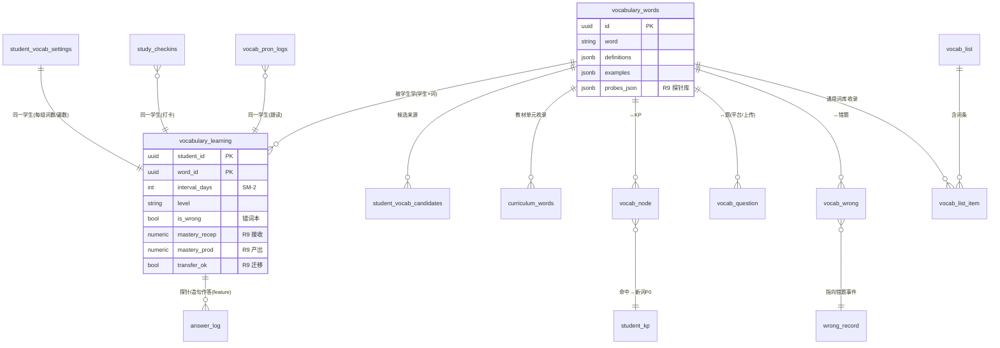

# 词力通(学生端)· 前端逻辑与数据表说明

> 对象:学生端 `frontend/miniprogram/src/pages/vocabulary/index.vue`(背词)+ 长难句页生词复现。
> 目的:讲清前端流程、各动作落到哪些后端表;含 ER 关系图。R9(可输入性理解)详见 [R9-技术方案-词汇可输入性理解.md](R9-技术方案-词汇可输入性理解.md)。

---

## 一、前端状态机

页面是一个 5 相状态机 `phase`:

```
empty(无词)   study(学新词) → review(复习词) → quiz(测试) → done(今日完成)
```

- **onMounted** → `GET /vocabulary/daily-task`:取 `new_words`(新词)+ `review_words`(到期复习词)。
  有新词→`study`;否则有复习词→`review`;都没有→`empty`。
- **一组学习循环**(由「学习设置」控制):
  - `words_per_group` 每组词数、`reps_per_group` 每组遍数、`wrong_carry_threshold` 错几次带入下组。
  - `study` 逐张新词卡 → `review` 复习卡 → `quiz` 4 选 1(干扰项从词池现生成)→ `done` 发音报告 + 「再来一组」。
  - **carry-over**:本组某词错够阈值 → 滚入 `carryWords` 进下一组继续考(`currentRep` 控遍数)。
- **顶部**:今日进度 + 7 天打卡日历(点亮/补签);**底部弹层**:学习设置、添加生词。

## 二、学词卡 + R9「检测理解」

每张卡:图 + 单词/音标/释义 + 例句 + 短语 + 单词发音 / 跟读 + 「记住了,下一个」。
R9 检测理解面板:
- 接收:语境填空 cloze + 多义辨析 → `mastery_recep`(可输入性理解)
- 产出:搭配选择 + 造句(LLM rubric)→ `mastery_prod`
- 迁移:换个句子(同词新语境)→ `transfer_ok`
- 显示「接收% · 产出%」,三维达标 = 「已掌握 ✓」

## 三、API → 服务 → 表 映射

| 前端动作 | API | 服务 | 落表 |
|---------|-----|------|------|
| 今日任务 | `GET /vocabulary/daily-task` | `vocabulary_service.get_daily_task`/`_ordered_new_words` | 读 `vocabulary_learning`+新词来源(`student_kp`/`vocab_node`/`curriculum_words`/`student_vocab_candidates`/`vocab_list*`)+`vocabulary_words` |
| 学习设置 | `GET·PUT /vocabulary/settings` | `get/set_vocab_settings` | `student_vocab_settings` |
| 测试作答(SM-2) | `POST /vocabulary/answer` | `submit_answer` | `vocabulary_learning` |
| 跟读评分 | `POST /vocabulary/shadow-score` | `pronunciation_service` | `vocab_pron_logs` |
| 添加生词 | `POST /vocabulary/add-word` | `add_manual_word` | `student_vocab_candidates`(查 `vocabulary_words`) |
| 错词本 | `GET /vocabulary/wrong-words` | `list_wrong_words` | `vocabulary_learning`(is_wrong)+`vocabulary_words` |
| 打卡 | `POST·GET /vocabulary/checkin*` | `checkin_service` | `study_checkins` |
| R9 取探针 | `GET /vocabulary/{id}/probes` | `vocab_probe_service.comprehension_probes` | 读 `vocabulary_words.probes_json`+`vocab_question`/`vocab_wrong`(语境句) |
| R9 提交探针 | `POST /vocabulary/{id}/probe` | `submit_probe`(BKT) | 写 `vocabulary_learning.mastery_recep/prod`+`answer_log`(vocab_probe) |
| R9 造句 | `POST /vocabulary/{id}/produce` | `submit_produce`(rubric) | 写 `vocabulary_learning.mastery_prod`+`answer_log`(vocab_produce) |
| R9 迁移 | `POST /vocabulary/{id}/transfer-submit` | `submit_transfer` | 写 `vocabulary_learning.transfer_ok` |
| R9 生词复现 | `GET /long-sentences/{id}/vocab-hits` | `incidental_hits` | 读 `vocabulary_learning`(未掌握词)命中句子文本 |

## 四、数据表清单(职责 + 关键字段)

**核心两张**
- `vocabulary_words` — 公共词典(共享只读):`word/phonetic/definitions/examples/phrases/difficulty/type/source/frequency/star`、媒体字段、**`probes_json`(R9 探针库)**。
- `vocabulary_learning` — 学生×词 个人学习态:SM-2(`interval_days/repetitions/easiness_factor/next_review_at/level`)+ 错词本(`is_wrong/wrong_count`)+ **R9 双维(`mastery_recep/mastery_prod/transfer_ok`)**。**有行 = 该生"在学/已学"。**

**新词来源**
- `student_kp` + `vocab_node` — 个人知识图谱命中词(新词最高优先 P0)。
- `curriculum_words` — 单元↔词(`is_core`),当前学期教材词(P1)。
- `student_vocab_candidates` — 候选词(`source=paper/wrong_question/manual`,P2)。
- `vocab_list` / `vocab_list_item` — 通用考纲词库(可 opt-in)。

**词的语境/关联(R9 个性化语境来源)**
- `vocab_question`(词↔平台/上传题)、`vocab_wrong`(词↔错题事件)→ `pick_context` 优先取学生自己题里的真实句。

**事件 / 旁路**
- `answer_log` — 作答事件流(探针 `feature=vocab_probe/vocab_produce`)。
- `wrong_record` — 错题事件(`vocab_wrong` 指向它,也是语境来源)。
- `vocab_pron_logs` — 跟读发音评测日志。
- `study_checkins` — 打卡记录。
- `llm_usage_log` — LLM 用量台账(探针/造句生成计入,后台看成本)。

## 五、ER 关系图



> 注:`student_vocab_settings`/`study_checkins`/`vocab_pron_logs` 与 `vocabulary_learning` 并非外键关系,只是同属一个 `student_id`(图中以"同一学生"标注)。

## 六、一次学习的数据流串联

```
新词从何来:student_kp/vocab_node(P0) · curriculum_words(P1) ·
            student_vocab_candidates(P2) · vocab_list(可选)  → 取自 vocabulary_words
   ↓ 学(学词卡:发音/例句来自 vocabulary_words)
R9 检测:probes 来自 vocabulary_words.probes_json;
        语境句来自 vocab_question/vocab_wrong→wrong_record→题干(学生自己的句)
   ↓ 答题 → 写 vocabulary_learning.mastery_recep/prod/transfer_ok + answer_log
   ↓ 旧 SM-2 测试 → 写 vocabulary_learning(interval/level/is_wrong)
   ↓ 错→is_wrong(错词本) · 跟读→vocab_pron_logs · 打卡→study_checkins
真正掌握:vocabulary_learning 三维达标 → 间隔拉长、移出错词本
跨模块复现:长难句/真题文本命中 vocabulary_learning 里未掌握词 → 顺势轻测
```
